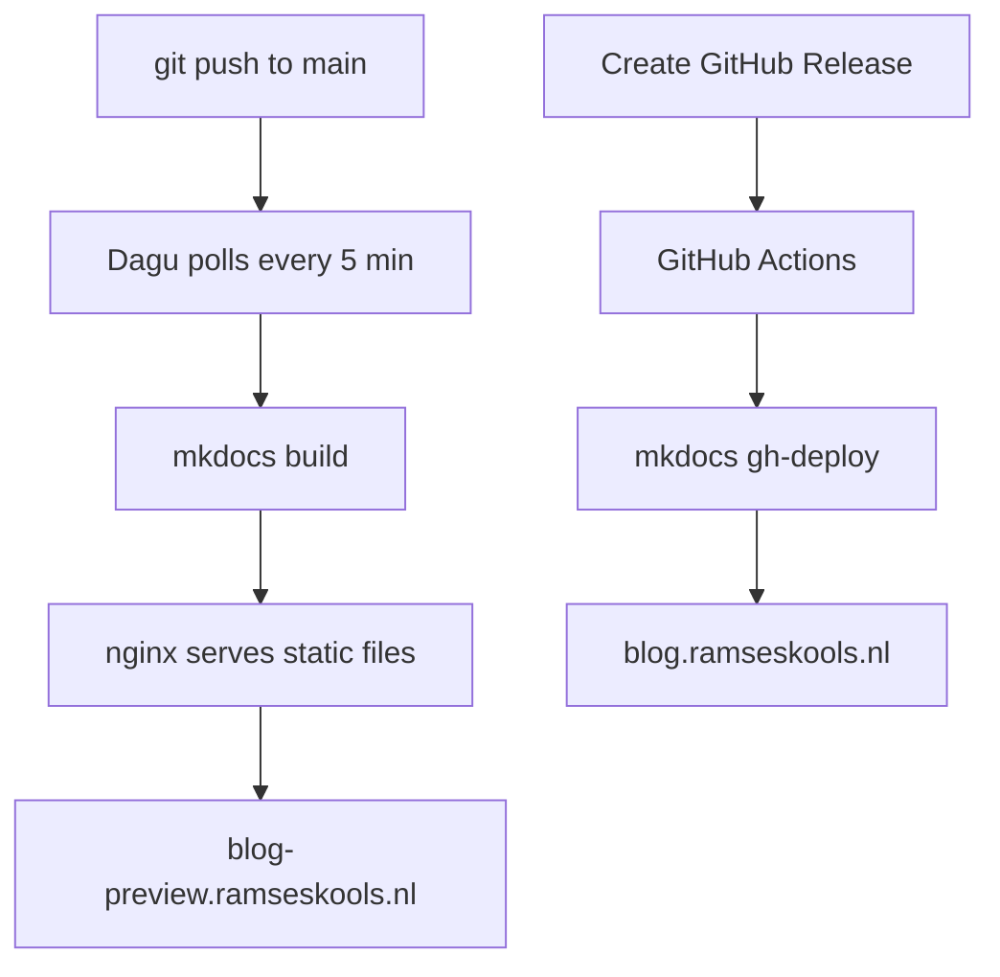

# How this blog is built

I like to write things down to structure my thinking.
Some of those things might be interesting to others too, so I decided to put them on a blog.
This post is about the blog itself: how it's built, deployed, and what tools I use.

<!-- more -->

## Design principles

A few things I wanted from the start:

- **Everything in Git.** Content, config, styling - all versioned together in one repo.
- **Markdown for content.** It has everything I need and keeps things portable.
- **Free and open-source tooling.** No vendor lock-in, no subscriptions.
- **Build in public.** The [repo is public](https://github.com/RamsesKools/my-blog).
Anyone can look behind the curtain and see how everything works.
I'm certainly not the first to set things up this way, but I think it's nice for visitors to be able to poke around.

## The stack

| Tool | Role |
|---|---|
| [MkDocs Material](https://squidfunnel.github.io/mkdocs-material/) | Static site generator with a blog plugin |
| [uv](https://docs.astral.sh/uv/) | Python package manager (`pyproject.toml` + `uv.lock`) |
| [GitHub Pages](https://pages.github.com/) | Public hosting (free, connected to my own domain) |
| [GitHub Actions](https://docs.github.com/en/actions) | CI/CD for public deployments |
| [Dagu](https://dagu.readthedocs.io/) | Task runner on my homeserver for preview deployments |
| [Traefik](https://traefik.io/traefik/) | Reverse proxy with automatic HTTPS |
| [nginx](https://nginx.org/) + Docker Compose | Serves the preview site |

MkDocs Material deserves a special mention.
It turns a folder of Markdown files into a clean, responsive website with search, navigation, and a built-in blog plugin.
The blog plugin handles post listing, date sorting, and drafts out of the box.
Very little config needed.

## Deployment

The blog has two deployment targets: a **preview** site on my homeserver and a **public** site on GitHub Pages.

### Preview

Every commit I push to `main` gets picked up automatically.
A [Dagu](https://dagu.readthedocs.io/) DAG on my homeserver polls the repo every 5 minutes.
When it detects new commits, it pulls and runs `mkdocs build`.
The output lands in a `site/` directory that nginx serves as static files, exposed through Traefik at `blog-preview.ramseskools.nl`.

This means I always have a live version of the blog running on my homeserver that I can check from any device on my network.
No manual steps needed.

### Public

When I'm happy with the state of things, I create a GitHub Release (or trigger the workflow manually).
A GitHub Actions workflow picks that up, tags the commit with a [CalVer](https://calver.org/) version (`YYYY.MM.DD`), and runs `mkdocs gh-deploy` to push the built site to GitHub Pages.

The public site lives at `blog.ramseskools.nl`.
GitHub Pages hosting is free and lets me use my own domain.

## Development workflow

Day-to-day writing looks like this:

1. **Live preview.**
`uv run mkdocs serve` starts a local dev server with hot reload.
Every save updates the page instantly.
2. **Drafts.**
Posts with `draft: true` in the frontmatter are visible during local serving but excluded from production builds.
This lets me work on posts without publishing them.
3. **Reproducible environment.**
Dependencies are locked with `uv.lock`, so the build is identical everywhere.
Clone the repo, run `uv run mkdocs serve`, done.
4. **AI-assisted writing.**
The whole project is plain text in a Git repo, which makes it easy for tools like [Claude Code](https://docs.anthropic.com/en/docs/claude-code) to help with writing, formatting, and other tasks.

## What's next

The setup is intentionally simple right now.
A few things I'll probably add over time:

- **Pre-commit hooks** for linting and link checking (I've set this up for another MkDocs project and it works well).
- **More content.** The best infrastructure is the one that gets used.
