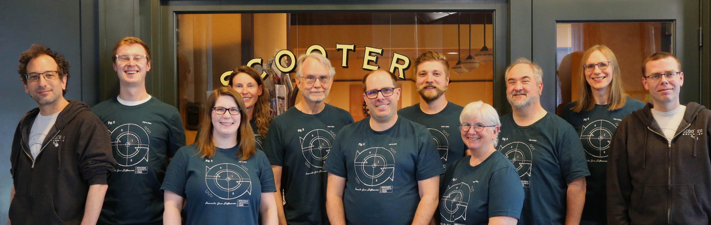

#  Beyond Compare

[Beyond Compare](https://www.scootersoftware.com/) is my favorite file and folder compare tool, and it has been for many years.
Whenever I need to know how two very similar sets of files or folders differ, this is the tool I reach for.

<!-- more -->

## How I started using it

I started using Beyond Compare before I was familiar with proper CI/CD practices.
Back then a deployment from the development environment (DEV) to the production environment (PRD) meant comparing the DEV files with the PRD files and updating the appropriate ones by hand.
I have gotten pretty far since then and no longer deploy things by manually changing files.

But Beyond Compare stuck around, because comparing similar sets of files never stopped being useful:

- **Configuration drift.** A folder with all the PRD configurations of a project next to the DEV configurations, and I want to know exactly where they differ.
- **Output diffing.** Two different versions of a system produced two different sets of output files for the same set of input files. Beyond Compare shows me precisely what changed between the versions.

## The company and the license

I like that Beyond Compare comes from a small company, [Scooter Software](https://www.scootersoftware.com/), that focuses on a single product and has been perfecting it for many years.

In [their own words](https://www.scootersoftware.com/about): an independent, employee-owned software company in Madison, Wisconsin, with over a million users worldwide and no aspirations to be a large company.
They aim to provide a useful and affordable tool and to do right by their customers and employees, which they consider more important than growth and profit.
And they have been profitable anyway, year after year, for over two decades.

/// caption
The Scooter Software team, from their [about page](https://www.scootersoftware.com/about).
///

I think it is amazing that a small group of passionate people can work this dedicately on one cool product for so long.

They also have a really fair licensing model: you pay once for a license and that allows you to use it.
You are free to try it for a period, and in practice you can 'try' it for much longer.
But if you fall in love with the software like I did, I do recommend paying for a license.

## Features I don't use that often (but are really cool)

Beyond Compare has a lot of powerful features beyond plain file and folder diffing:

- **Image compare.** Great for inspecting differences in UI screenshots between product versions, or for cheating at a spot-the-differences puzzle.
- **CLI tool.** Run comparisons from the command line. Sounds really nice, and maybe a good tool to teach my AI agents?
- **Server connectivity.** Compare against remote machines over SSH, FTP, and more.
- **3-way folder merge.** Merge two sets of changes against a common base, for whole folders.
- **Custom compare rules.** Very powerful if you want to ignore specific things in comparisons, such as `v=0.1.0` vs `v=0.1.1` or `env=dev` vs `env=prd`.
- **Table compare.** Compare CSV-like data by cell instead of by line.
  It even opens Excel files directly, which I don't use but maybe should: comparing two spreadsheets cell by cell beats eyeballing them side by side.
- **Hex compare.** Diff binary files when text compare won't cut it.

## What I don't use it for

I don't use it for solving merge conflicts.
The VS Code built-in tools are better there, since they are tightly coupled with my editor.

I also don't really use it to compare branches of a git repo, since better tools exist for that too.

Beyond Compare shines when the things you compare are not in version control: folders, exports, configurations, and outputs that just happen to be almost the same.
